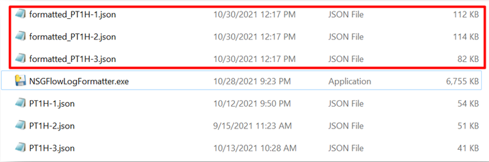
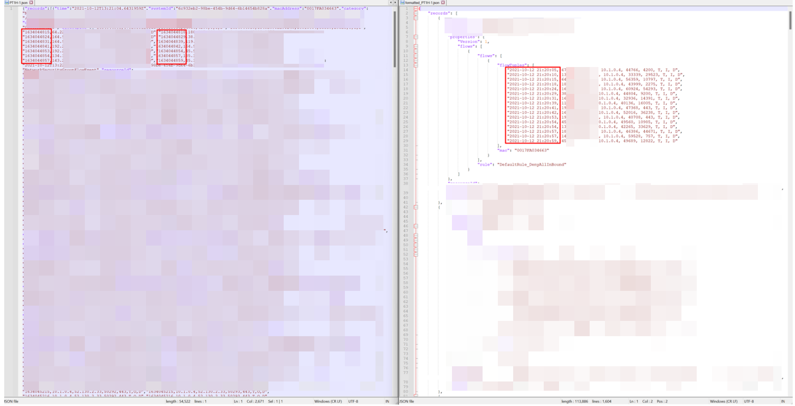

# NSGflowlog-formatter

**[Intro.]**

Azure NSG flow log is originally not very readable, so I wrote this script to format it for human friendliness.

**[Usage]:** 

It’s simple!

Just put the *.json* log files in the same directory of the *NSGFlowLogFormatter.exe*, and double click *the NSGFlowLogFormatter.exe* file. As a result, all the *xx.json* files in the same directory will be formatted into new *formatted_xxx.json* files.

 

**[Result]:**

"# NSGflowlog-formatter" 
